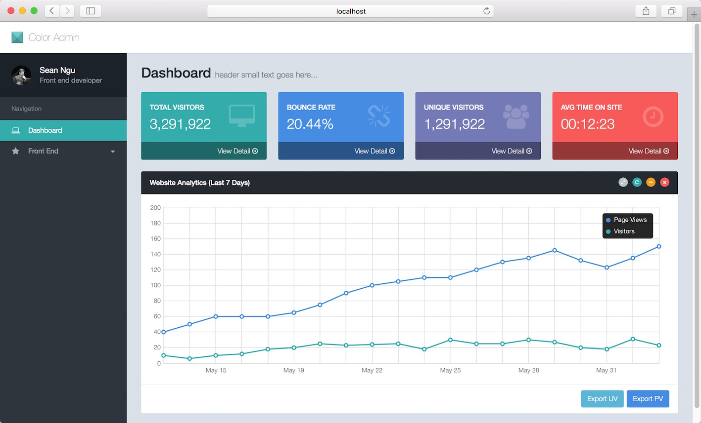

koa2-boilerplate
====

  [](https://hub.docker.com/r/superalsrk/koa2-boilerplate/builds/) [](https://microbadger.com/images/superalsrk/koa2-boilerplate "Get your own image badge on microbadger.com")

This boilerplate shows ways to 

+ Use mysql in Koa2
+ CORS Ajax request
+ Ajax Login and Ajax Logout in Koa2, based on [koa-passport](https://github.com/rkusa/koa-passport) and [passport-local](https://github.com/jaredhanson/passport-local)
+ Export excel in Koa2, based on [excel-export](https://github.com/functionscope/Node-Excel-Export)
+ Serve static files in Koa2
+ Integrate with Redux App
+ Use charts(D3.js, Echarts, plot) library in Redux App
+ Deploy Koa2 app with docker

### Preview

[Online Demo](http://koa2-boilerplate.tarax.cn)

### Usage

```bash
$ npm install 

# Start application
$ npm run dev

# Run test cases
$ npm run test

# Generate test report
$ npm run report
```

You can also use docker to start this boilerplate

```
$ docker pull superalsrk/koa2-boilerplate
$ docker run -d -p 5000:5000 superalsrk/koa2-boilerplate
```

### Develop & Deploy

+ [中文版](https://github.com/superalsrk/koa2-boilerplate/wiki/develop-and-deploy.md)
+ [English](https://github.com/superalsrk/koa2-boilerplate/wiki/develop-and-deploy-en.md)

## Screenshots

+ Login Page


+ Dashboard



### License

MIT


 